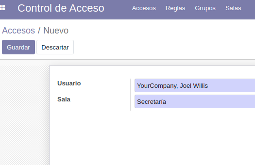

# Control de Acceso

Este módulo de Odoo permite controlar y registrar el acceso de personas a diferentes salas.

## Detalles de implementación

### Modelos

 * Se extiende el modelo _res.groups_
 * _Sala_ es un modelo base.
 * _Regla_ almacena los datos de acceso
	* _GrupoAcceso_
	* _Sala_
	* DiaHora de inicio
	* DiaHora de fin (puede ser nulo)
	* Tipo (Permitir / Denegar)
	* Repetir (No, Semanal, Mensual, Anual)
		* DiaSemana (null)
		* DiaMes (null)
		* Mes (null)
		* Hora (null)
		* Minuto (null)
 * _Acceso_ es un modelo que registra quién accede a cada sala
	* Al crear un registro pide un usuario y una sala
	* Comprueba las reglas asociadas a cada sala y usuarios
	* Si el usuario no tiene permiso, salta un error denegándole el acceso.

## Funcionamiento

 * Se registran grupos y salas (_Sala_)

 * Se configuran los grupos que pueden acceder a cada sala en el menú de reglas.

 
 

 * Cuando un usuario intenta entrar en una sala, se crea un registro de _Acceso_

 

 * Si no tiene permiso salta un error

 

## Notas

### Datos de prueba

Se incluyen algunos datos de prueba, pero en mi contenedor no se cargan registros de _res.partner_ de forma que fallan al cargar los grupos. Lo probé con el proyecto de recetas de Odoo de clase y tampoco funciona. Sospecho que tiene que ver con que usé un contenedor de Docker, en vez de LXD, porque a otros compañeros de clase sí que le funciona.

### Ideas extra

 * Se podría utilizar el sistema de permisos nativo de Odoo en vez de implementar uno desde cero, ya que el algoritmo actual no funciona demasiado bien.
 * Originalmente iba a utilizar un _wizard_ para pedir algunos datos, pero al final no fue necesario. De todas formas dejé el código en el repositorio ([models/wizard.py](models/wizard.py) y [views/user_actions.xml](views/user_actions.xml))
 * Con más recursos y tiempo probablemente sería posible automatizar la creación de accesos.
